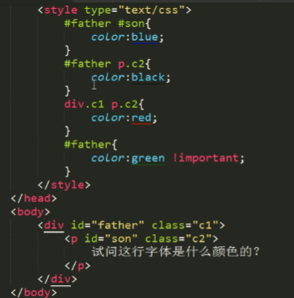
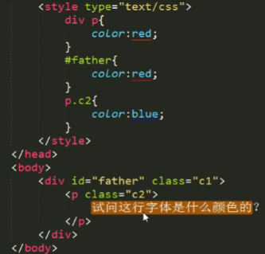
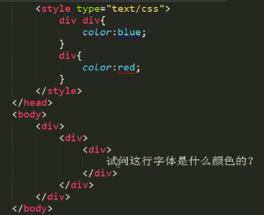

# 【CSS三大特性】

> 本文档是个人对 Pink 老师课程的总结归纳及补充，转载请注明出处！ 

CSS 有三个非常重要的特性：`层叠性`、`继承性`、`优先级`。

## 层叠性

给同一个选择器设置相同的样式，此时一个样式就会**覆盖**（层叠）另一个冲突的样式，**层叠性主要解决样式冲突的问题**。

层叠性原则：

- 样式冲突，遵循的原则是 `就近原则`，哪个样式距离结构近，就执行哪个样式
- 样式不冲突，不会层叠

注：就近的标准是：**后 > 前**

```html
<!doctype html>
<html lang="en">

<head>
    <meta charset="UTF-8">
    <meta http-equiv="X-UA-Compatible" content="IE=edge">
    <meta name="viewport" content="width=device-width, initial-scale=1.0">
    <title>CSS三大特性之层叠性</title>
    <style>
        div {
            color: red;
        }

        div {
            color: pink;
        }
    </style>
</head>

<body>
    <!-- pink 色 -->
    <div>周吉瑞</div>
</body>

</html>
```

## 继承性

现实中的继承：我们继承了父亲的姓。

CSS 中的继承：**子标签会继承父标签的某些样式**，如：文本颜色和字号，简单的理解就是：子承父业。

- 恰当地使用继承可以简化代码，降低 CSS 样式的复杂性
- 子元素可以继承父元素的样式（ `text-`、`font-`、`line-`、`color` ） 文本、字体、段落、颜色

```html
<!doctype html>
<html lang="en">

<head>
    <meta charset="UTF-8">
    <meta http-equiv="X-UA-Compatible" content="IE=edge">
    <meta name="viewport" content="width=device-width, initial-scale=1.0">
    <title>CSS三大特性之继承性</title>
    <style>
        div {
            color: pink;
            font-size: 14px;
        }
    </style>
</head>

<body>
    <div>
        <p>周吉瑞</p>
    </div>
</body>

</html>
```

**行高的继承**

```css
body {
    font: 12px/1.5 'Microsoft YaHei';
}
```

- 行高可以跟单位也可以不跟单位
- 如果子元素没有设置行高，则会继承父元素的行高为 1.5
- 此时子元素的行高是：**当前元素**的**文字大小** * 1.5
- body 行高 1.5 这样写法最大的优势就是**里面的子元素可以根据自己文字的大小自动调整行高**

```html
<!doctype html>
<html lang="en">

<head>
    <meta charset="UTF-8">
    <meta http-equiv="X-UA-Compatible" content="IE=edge">
    <meta name="viewport" content="width=device-width, initial-scale=1.0">
    <title>CSS三大特性之继承性——行高的继承</title>
    <style>
        body {
            color: pink;
            /* font: 12px/18px; */
            font: 12px/1.5;		/* 12 + 12 * 0.5 = 18 */
        }

        div {
            /* 子元素继承了父元素 body 的行高 1.5 */
            /* 这个 1.5 就是当前元素文字大小 font-size 的 1.5 倍 */
            /* 所以当前 div 的行高就是：14 + 14 * 0.5 = 21px */
            font-size: 14px;
        }

        p {
            /* 1.5 * 16 = 24 当前行高 */
            font-size: 16px;
        }

        /* li 没有手动指定文字大小，则会继承父亲（此处的父亲可以层层向上推）的文字大小  */
        /* 即：body 12px 所有 li 的文字大小为 12px */
        /* 当前 li 的行高就是 12 * 1.5 = 18  */
    </style>
</head>

<body>
    <div>周吉瑞</div>
    <p>JERRY</p>
    <ul>
        <li>没有指定文字大小</li>
    </ul>
</body>

</html>
```

## 优先级

- 选择器相同，则执行层叠性
- 选择器不同，则根据选择器权重执行

**选择器权重如下表所示：**

| 选择器                   | 选择器权重 |
| ------------------------ | ---------- |
| 继承 或  `*`             | `0,0,0,0`  |
| 元素选择器、伪元素选择器 | `0,0,0,1`  |
| 类选择器、伪类选择器     | `0,0,1,0`  |
| ID 选择器                | `0,1,0,0`  |
| 行内样式 style=""        | `1,0,0,0`  |
| !important 重要的        | `∞` 无穷大 |

**规则：**比较位级别，位级别相同时比较位大小。

```html
<!doctype html>
<html lang="en">

<head>
    <meta charset="UTF-8">
    <meta http-equiv="X-UA-Compatible" content="IE=edge">
    <meta name="viewport" content="width=device-width, initial-scale=1.0">
    <title>CSS三大特性之优先级</title>
    <style>
        div {
            color: pink;
        }

        .test {
            color: red;
        }

        #demo {
            color: green;
        }
    </style>
</head>

<body>
    <div class="test">你笑起来真好看</div> <!-- red -->
    <div class="test" id="demo">你笑起来真好看</div> <!-- green -->
    <div class="test" id="demo" style="color: blue;">你笑起来真好看</div> <!-- blue -->
<!-- 
    假如在 css 选择器 某一个属性值后面跟上 !important，那么这个属性一定会执行！
    例如：div {
             color: pink !important;  
          }
          ...
    <div class="test" id="demo" style="color: blue;">你笑起来真好看</div> -- pink --
-->

</body>

</html>
```

**优先级注意问题：**

- 权重是由 4 组数字组成的，但是不会有进位！
- 可以理解为：`类选择器` 永远大于 `元素选择器`，`ID 选择器` 永远大于 `类选择器`，以此类推！
- 等级判断 `从左到右`，如果某一位数值相同，则判断下一位数值
- 可以简单的记忆：`通配符` 和 `继承` 权重为 0，`标签选择器` 为 1，`类`（`伪类`）选择器为 10，`ID` 选择器为 100，`行内样式表` 为 1000，`!important` 无穷大
- **继承的权重是 0，不管父元素权重多高，子元素得到的权重都是 0 ！**
- 相当于优先级的权重计算只存在于同层次之间？
- `a` 链接浏览器默认指定了一个样式，所以它不参与继承，所以设置样式需要选中单独设置

```html
<!doctype html>
<html lang="en">

<head>
    <meta charset="UTF-8">
    <meta http-equiv="X-UA-Compatible" content="IE=edge">
    <meta name="viewport" content="width=device-width, initial-scale=1.0">
    <title>CSS三大特性之优先级——注意问题</title>
    <style>
        /* 父亲的权重是 100 */
        #father {
            color: red !important;
        }

        /* p 继承的权重为 0 */
        /* 所以以后我们看标签到底执行哪一个样式，就先看这个标签有没有直接被选出来
           如果直接被选择出来了，那么就与父亲无关了！*/
        p {
            color: pink;
        }
    </style>
</head>

<body>
    <!-- 继承的权重是 0，不管父元素权重多高，子元素得到的权重都是 0 -->
    <div id="father">
        <p>你还是很好看</p> <!-- pink -->
    </div>
    <!-- a 链接浏览器默认指定了一个样式，所以它不参与继承，所以给 a 改样式必须直接把 a 选出来 -->
    <a href="#">我是单独的样式</a>
</body>

</html>
```

**权重的叠加：**

如果是复合选择器，则会有权重叠加，需要计算权重。

注意：再次强调！权重虽然会叠加，但一定不会进位！（1万个元素选择器也比不过一个类选择器）。

从左到右逐位比较，只有左一位同样大，才比较右边一位！

**例如：**

- `div ul li` ——> `0,0,0,3`
- `.nav ul li` ——> `0,0,1,2`
- `a:hover` ——> `0,0,1,1`
- `.nav a` ——> `0,0,1,1`

如果要对某一元素设置样式，那么就必须给它足够高的权重（注意：是给他，而不是他的父亲！）。

> 提高选择器权重的技巧之一：
>
> - 多写几层类选择器

```html
<!doctype html>
<html lang="en">

<head>
    <meta charset="UTF-8">
    <meta http-equiv="X-UA-Compatible" content="IE=edge">
    <meta name="viewport" content="width=device-width, initial-scale=1.0">
    <title>CSS三大特性之优先级——权重叠加</title>
    <style>
        /* 复合选择器会有权重叠加的问题 */
        /* 权重虽然会叠加，但是永远不会有进位 例如：十个 0,0,0,1 相加为 0,0,0,10 而不是 0,0,1,0 */
        /* ul li 权重 0,0,0,1 + 0,0,0,1 = 0,0,0,2 */
        ul li {
            color: green;
        }

        /* li 的权重是 0,0,0,1 */
        li {
            color: red;
        }

        /* .nav li 权重 0,0,1,0 + 0,0,0,1 = 0,0,1,1 */
        .nav li {
            color: pink;
        }
    </style>
</head>

<body>
    <ul class="nav">
        <li>大猪蹄子</li>	<!-- pink -->
        <li>大肘子</li>	<!-- pink -->
        <li>猪尾巴</li>	<!-- pink -->
    </ul>
</body>

</html>
```

# CSS权重6道精华题

1. 

蓝色

2. 

蓝色

3. 

蓝色

4. 

红色 
